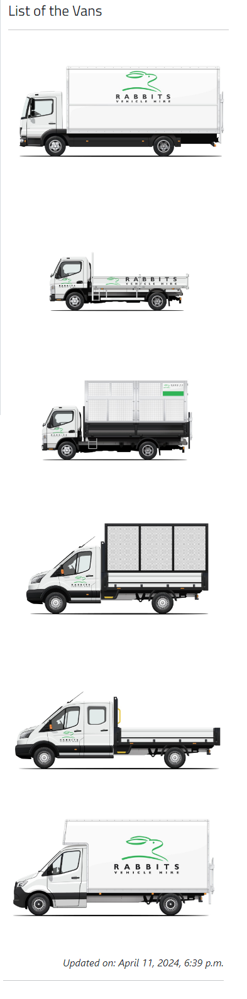
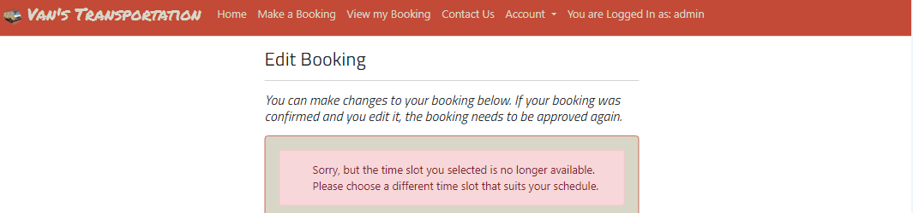

# Van's Transportation

 - Van's Transportation is a website designed for hassle-free bookings, allowing users to easily book the services they need. The site eliminates the need for lengthy phone calls, where responses are often delayed or require callbacks. Once a booking request is submitted through the website, administrators can promptly review and approve it, streamlining the process for both users and the company.

[Live Website] (https://vansbooking-37cc026955c5.herokuapp.com/)

[Github Repository] (https://github.com/terintealexandrin18/vansbooking)

## Table of Contents
1. - [User Experience UX](#User-Experience-UX)
    - [Strategy](#Strategy)
      - [Project Goals](#project-goals)
      - [User Goals](#user-goals)
      - [User Stories](#user-goals)
      - [Track User Stories - Kanban Board](#track-user-stories---kanban-board)
    - [Surface](#surface)
      - [Color Scheme](#color-scheme)
      - [Typography](#typography)
2. - [Features](#features)
      - [Existing Features](#existing-features) 
      - [Future Features](#future-features)
3. - [Technologies Used](#technologies-used)
      - [Languages Used](#languages-used)
      - [Frameworks, Libraries & Programs](#frameworks-libraries--programs)
4. - [Testing](#testing)
        - Go to [TESTING.md](TESTING.md)
5. - [Bugs](#bugs)
        - [Unfixed Bugs](#unfixed-bugs)
        - [Fixed Bugs](#fixed-bugs)
6. - [Deployment](#deployment)
7. - [Finished Product](#finished-product)
8. - [Credit](#credit)

9. Acknowledgement

## 1. - User Experience (UX)
### - Strategy
#### - Project Goals
- Develop a fully responsive website for seamless use on both mobile devices and computers.
- Enable user registration and login for account creation and secure access.
- Allow users to view their booking history easily.
- Provide users with access to booking status updates.
- Implement measures to prevent double booking and reduce human error.
- Display available services for user selection and information.
- Facilitate easy contact with the company for inquiries and support.

### - User Goals
- As a Site User, I want to register a new account so that I can make online bookings.
- As a Site User, I want to log in to have my details automatically filled in when making a booking.
- As a User, I want to access comprehensive information about the services and company on the dashboard.
- As a Site User, I want to see available time slots to choose and book the desired slot.
- As a Site User, I want to make a booking by selecting the desired service from a drop-down list to avoid manual information provision.
- As a Site User, I want to provide additional details about the service I need for better communication with the company.
- As a Site User, I want to view my bookings to check their confirmation status, whether pending or confirmed.
- As a Site User, I want the ability to delete a booking by clicking on a button for easy management.
- As a Site User, I want to edit a booking by clicking the edit button to make changes without contacting support.
- As a Site Admin, I want to view, approve, or delete bookings to effectively manage bookings and prevent double bookings.
- As a Site User, I want easy access to the contact page to discuss additional booking details and services.

### Track User Stories - Kanban Board
- Throughout the project, I utilized the GitHub Kanban board extensively to manage user stories effectively. This approach facilitated the prioritization of tasks and provided a clear visualization of the project's progress at every stage.

- Week 1

  - 
  - 

- Week 3
  - "Edit user details" user story will be implemented in Phase two.
  - 

## Surface
### Color Scheme
- The color scheme of the website primarily consists of shades of grey, muted orange, and a few accent colors. The colors were chosen for simplicity, featuring a light color scheme with an accentuated orange to highlight the most important items.

- Greys:
  - #d8d7c7: Used for backgrounds, text, and buttons.
  - #768581: Utilized for buttons and the banner background.
  - #4c514e: Present in darker button shades.

- Orange:
  - #C34A36: Employed for the navbar background and certain accents.

- Other Colors:
  - Transparent orange hue indicating pending status of the booking.
  - Transparent green tint signifying approved status of the booking.
  - Transparent red shade denoting cancelled status of the booking.

- Overall, the color palette gives a professional and muted appearance, with the orange accents adding a touch of vibrancy. It offers a clean and modern aesthetic.

  - 

### Typography
- The website primarily uses two fonts: Permanent Marker and Titillium Web. These fonts were specifically chosen for their unique combination of personality and readability. Permanent Marker adds informality and style to headings, while Titillium Web ensures clear readability for heading text. For the rest of the website, the fonts will be determined by the user's browser.

- To maintain visual consistency throughout the site, the fonts are adjusted dynamically with media queries to ensure optimal readability across various screen sizes. This means that font sizes will adapt to ensure the best reading experience on any device.

## Features
### Existing Features 
- Logo
  - The logo, featuring the title "Van's Transportation" alongside a small van icon, serves the dual purpose of clearly communicating the page's content and functionality to users, while also providing a consistent link to the home page visible across all screen sizes on the navigation bar.

    - 

- Navigation Bar
  - The navigation bar remains fixed at the top of large screens, allowing seamless navigation between pages: Home, Make a Booking, View my Booking, Contact Us, and Account. Within the Account section, users can access a dropdown for logging in or registering. At the end of the navigation tabs, the username is displayed if logged in, or "You are not logged in" if not. On small screens, the navigation bar is hidden to improve content accessibility and can be accessed through a dropdown menu activated by clicking the three horizontal lines symbol.

    - Larger Screen sizes:
      -  

    - Small Screens sizes:
      - 

- Landing Page Introduction
  - The landing page serves to introduce visitors to the company, providing an overview of the services offered, and highlighting the key benefits of choosing Van's Transportation. It encourages visitors to explore further and take action by booking a service.
    - 

- Services Provided
  - The service list feature informs visitors about the various services offered by the company. Each service title is accompanied by its own icon, and the tiles function as links to the booking page. Below the services are two buttons—one for booking and another for contacting the company. 

  - The services are aligned vertically in a row on large screens, while on small screens, they are aligned vertically as a list. This ensures optimal display and usability across different screen sizes.
  
    - Larger Screen sizes:
      - 

    - Small Screen sizes:
      - 

- List of Vans
  - The list of vans feature provides users with valuable information by showcasing all types of vehicles available, helping them choose the right van for their service needs. Additionally, the date of the vehicles' last update is displayed at the bottom of images, ensuring users have access to the most current information.
  - On small screens, the images are displayed vertically for ease of browsing, while on large screens, are arranged horizontally as a list. This thoughtful design ensures optimal display and usability across different screen sizes, allowing users to conveniently explore and select the right van for their service needs.
  
    - Larger Screen sizes:
      - 

    - Small Screen sizes:
      - 

- Footer 
  - The footer includes links to the company's social media profiles and opening hours, offering users valuable connectivity to stay updated on news and promotions while providing essential information for planning visits or contacting during operational hours.
  - The image of delivery in the footer of the landing page holds significant value as it visually represents a key aspect of the company's services, while also prompting users to explore the entire landing page where they can find important information such as working hours. This image serves to evoke a sense of reliability and efficiency, subtly encouraging visitor engagement and differentiation from other pages on the website.
  
    - Larger Screen sizes:
      - All pages footer
        - 
      - Landing page footer
        - 
    
    - Small Screen sizes:
      - All pages footer
        - 
      - Landing page footer
        - 

- Make a Booking page
  - Booking a service is a pivotal feature of the website, facilitating the process of scheduling appointments. Users are required to fill out all fields in the form, including their phone number, desired service, booking date, and additional comments. The comments section allows users to provide specific details such as their address, type of waste collection, or preferences regarding van pick-up or drop-off locations. This comprehensive form ensures that users can provide all necessary information to streamline the booking process effectively. Need to be log in to be able to make a booking.

    - Larger Screen sizes:
      - 
    - Small Screen sizes:
      - 

  - After making a booking, the user receives the message "Your booking request has been submitted successfully," providing reassurance and confirmation that their request has been received and processed by the system. This message adds value to the user by instilling confidence in the booking process, offering peace of mind that their service request has been successfully communicated to the company, and setting clear expectations for next steps in the service process. Additionally, the user is automatically redirected to the "View My Booking" page, allowing them to conveniently track the status of their booking and access any relevant details or updates.
  
    - Larger Screen sizes:
      - 
    - Small Screen sizes:
      - 

  - If a user attempts to book a time slot that has already been booked by someone else, they will receive an error message stating: "Sorry, but the time slot you selected is no longer available. Please choose a different time slot that suits your schedule." This prompt is crucial as it promptly informs the user that the desired time slot is unavailable, allowing them to swiftly adjust their booking preferences without further delay.

    - Larger Screen sizes:
      - 
    - Small Screen sizes:
      - 

- Your Booking page
  - Users can view all of their previous bookings and their current statuses by accessing the relevant page on the website. To view this information, users must be logged in. Pending bookings will be highlighted in transparent orange, confirmed bookings in transparent green, and cancelled bookings in transparent red.

  - Additionally, users have the option to modify or cancel their bookings, which gives them greater flexibility and control over their scheduled services. If a confirmed booking is modified, the user will need to wait for confirmation from the admin once again.
  
  - This feature enhances user experience by offering transparency, clarity, and convenient management of booking statuses.

    - Larger Screen sizes:
      - 
    - Small Screen sizes:
      - 

  - If a user attempts to edit a booking and the desired time slot is already booked, they will receive an error message notifying them of the conflict. This message serves to alert the user that the requested time slot is unavailable for editing, prompting them to select a different time slot.

    - Larger Screen sizes:
      - 
    - Small Screen sizes:
      - 
    
  - Upon updating a booking, the user receives a confirmation message. To delete a booking, the user's details are shown, and they confirm deletion by pressing the delete button again or the back button, redirecting them to the view bookings page. These confirmation messages and security measures ensure a smooth and secure user experience when managing bookings on the platform.

    - Larger Screen sizes:
      - 
    - Small Screen sizes:
      - 
- Account page
  - Sign up : Allow users to create an account on the website.

    - Larger Screen sizes:
      - 
    - Small Screen sizes:
      - 

  - Log In: Allows users to access their accounts, enabling them to make, view, edit, and delete bookings.
    
    - Large & Small screen sizes: 
      - 

  - Sign Out: Enables users to securely log out from their accounts.
    - Large & Small screen sizes: 
      - 

  - Sign Up, Log In, and Sign Out functionalities include notification messages to provide users with feedback and confirmation of their actions.
    - Large & Small screen sizes:
      - 

- Contact us page 

  - The "Contact Us" page features a detailed form that requires users to fill in all fields before submission. In addition, multiple contact channels are provided, such as phone, email, and in-person visits. These elements are aligned parallel to each other on large screens, with the map displayed underneath. On smaller screens, they are arranged in a single column, ensuring optimal layout and accessibility across devices. This design ensures that users have various options to reach us and access our contact information conveniently.

    - Larger Screen sizes:
      - 
    - Small Screen sizes:
      - 
## Technologies Used
### Future Features
 - Enable users to edit their details.
 - Enhance defensive programming techniques for improved security.
 - Develop a separate interface for admin.
 - Expand user account functionality to include additional details such as full name and address.

### Languages Used

[HTML5](https://en.wikipedia.org/wiki/HTML)

[CSS3](https://en.wikipedia.org/wiki/CSS)

[JavaScript](https://en.wikipedia.org/wiki/JavaScript)

[Python](https://en.wikipedia.org/wiki/Python_(programming_language))

### Frameworks, Libraries & Programs

[Fontawesome](https://fontawesome.com/) - Utilized to incorporate icons into the landing page, enhancing visual appeal and user experience. 

[Google Fonts](https://fonts.google.com/) - Utilized to import fonts into the CSS file, ensuring consistency in typography across all sections of the website.

[Bootstrap 5](https://getbootstrap.com/docs/5.0/getting-started/introduction/) - Utilized throughout the website to help with styling and responsiveness.

[Django](https://www.djangoproject.com/) - Utilized as web framework.

[Django Allauth](https://docs.allauth.org/en/latest/) - Utilized for account management functionalities: sign up, sign in and sign out processes.

[gunicorn](https://pypi.org/project/gunicorn/) - A Python WSGI HTTP Server

[dj_databsae_url](https://pypi.org/project/dj-database-url/) - Allowed to utilise the DATABASE_URL variable.

[psycopg2](https://pypi.org/project/psycopg2/) - Utilized to facilitate connections between the application and a PostgreSQL database

[Cloudinary ](https://cloudinary.com/) - Utilized for cloud-based images management services, enabling seamless storage, optimization, and delivery of images for the website.

[PostgreSQL](https://www.postgresql.org/) - Utilized as a database management system.

[ElephantSQL](https://www.elephantsql.com/) - PostgreSQL database hosting service.

[Gitpod](https://www.gitpod.io/) - Utilized for writing code, committing changes, and pushing to GitHub.

[GitHub](https://github.com/) - Utilized to store the project repository and managed user story through Kanban board.

[Heroku](https://www.heroku.com/) - Utilized to deploy the project. 

[DevTools](https://developer.chrome.com/docs/devtools/) - Utilized for troubleshooting, testing features, responsiveness and styling.

[W3C Markup Validator](https://validator.w3.org/) - Utilized to validate the HTML code.

[W3C CSS Validator](https://jigsaw.w3.org/css-validator/) - Utilized to validate the CSS.

[JSHint](https://jshint.com/) - Utilized to validate the JavaScript code.

[CI Python Linter](https://pep8ci.herokuapp.com/) - Utilized to validate the Python code. 

## Testing

- Go to [TESTING.md](TESTING.md)

## Deployment

Step 1: Installing Dependencies:

1 - Install Django, gunicorn, and supporting libraries: pip3 install 'django<4' gunicorn dj_database_url==0.5.0 psycopg2 dj3-cloudinary-storage

2 - Create a requirements file: pip3 freeze --local > requirements.txt

3 - Create project: django-admin startproject vans .

4 - Create App: 

    - python3 manage.py startapp homepage

    - python3 manage.py startapp allbookings

    - python3 manage.py startapp viewthebooking

    - python3 manage.py startapp contact

5 - Add to installed apps in setting.py(Save file)

6 - Migrate changes python3 manage.py migrate

7 - Run Server to Test python3 manage.py runserver

Step 2: Deploying an app to Heroku:

1 - Create a new external Database:

    - Go to ElephantSQL.com, create a new instance, and copy the URL.

2 - Heroku app setup:

    - Create a new Heroku app and attach the ElephantSQL database.

    - Set config vars for DATABASE_URL and SECRET_KEY.

3 - Prepare environment and settings.py file:

    - Create env.py in Gitpod and set environment variables.

    - Add Cloudinary settings to settings.py.

    - Update ALLOWED_HOSTS and create a Procfile.

4 - Deploy

    - Save files, make migrations, and commit changes.

    - Remove COLLECT_STATIC FILES from Heroku config vars.

    - Deploy content through Heroku manually.

## Bugs 
### Unfixed Bugs

- The current web URL extensions are causing repetition of names, which can create confusion and negatively impact search engine optimization. Although this issue has been identified, it cannot be addressed immediately due to time constraints. However, resolving this issue is relatively simple by adjusting the URL configuration of the apps to ensure consistency and clarity in naming conventions.

  - 

- In Gitpod's terminal, Python detected three issues related to the gitpod.yml extension. However, these issues do not affect the functionality of the project.

  - 

- While checking the HTML code via URI, the website encountered four errors related to the Summernote Editor. However, these issues do not affect the project's functionality.
  
  - 

### Fixed Bugs 

- When I checked the Python code, most of it had to be split into more rows because it was longer than the limit of 79 characters.

  - 

## Finished Product

|Page | Large Screen | Small Screen|
| --- | --- |--- |
|Home Page|     |    |
|Make a Booking |     |    |
|View my Booking |     |    |
|Contact Us   |     |    |
|Edit Booking     |     |    |
|Delete Boocking |     |    |
|Sign Up     | |   |
|Log In    |     |    |
|Log out     |     |    |

## Credit

- Media
  - [Pixabay](pixabay.com) - Image from logo website.
  - [Pexels](https://www.pexels.com/) - Image for landing page footer.
  - [Rabbits](https://www.rabbits.co.uk/) - Images for list of the vans from landing page.

- Code
  - Code Institute team for bits of advice

## Acknowledgments

- Marcel has provided valuable tutoring, offering guidance, feedback, and support, while also addressing key points discussed during our meetings.
- My wife for taking the time to check the website and providing me with valuable feedback. Her input was truly helpful.
- Code institute team for support and advice