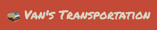

# Van's Transportation

Van's Transportation is a website designed for hassle-free bookings, allowing users to easily book the services they need. The site eliminates the need for lengthy phone calls, where responses are often delayed or require callbacks. Once a booking request is submitted through the website, administrators can promptly review and approve it, streamlining the process for both users and the company.

[Live Website] (https://vansbooking-37cc026955c5.herokuapp.com/)
[Github Repository] (https://github.com/terintealexandrin18/vansbooking)

## Table of Contents
1. - User Experience (UX)
    - Strategy
        - Project Goals
        - User Goals
        - User Stories
        - Track User Stories - Kanban Board
    - Surface
        - Color Scheme
        - Typography
2. - Features
        - Existing Features 
        - Future Features
3. - Technologies Used
    - Languages Used
    - Libraries and Frameworks
    - Packages / Dependecies Installed
    - Database Management
    - Tools and Programs
4. - Testing
        - Go to testing.md (to make it..)
5. - Deployment
6. - Finished Product
7. - Credit
8. - Bugs
        - Unfixed Bugs
        - Fixed Bugs
9. Acknowledgement

## 1. - User Experience (UX)
### - Strategy
#### - Project Goals
- Develop a fully responsive website for seamless use on both mobile devices and computers.
- Enable user registration and login for account creation and secure access.
- Allow users to view their booking history easily.
- Provide users with access to booking status updates.
- Implement measures to prevent double booking and reduce human error.
- Display available services for user selection and information.
- Facilitate easy contact with the company for inquiries and support.

### - User Goals
- As a Site User, I want to register a new account so that I can make online bookings.
- As a Site User, I want to log in to have my details automatically filled in when making a booking.
- As a User, I want to access comprehensive information about the services and company on the dashboard.
- As a Site User, I want to see available time slots to choose and book the desired slot.
- As a Site User, I want to make a booking by selecting the desired service from a drop-down list to avoid manual information provision.
- As a Site User, I want to provide additional details about the service I need for better communication with the company.
- As a Site User, I want to view my bookings to check their confirmation status, whether pending or confirmed.
- As a Site User, I want the ability to delete a booking by clicking on a button for easy management.
- As a Site User, I want to edit a booking by clicking the edit button to make changes without contacting support.
- As a Site Admin, I want to view, approve, or delete bookings to effectively manage bookings and prevent double bookings.
- As a Site User, I want easy access to the contact page to discuss additional booking details and services.

### Track User Stories - Kanban Board
- Throughout the project, I utilized the GitHub Kanban board extensively to manage user stories effectively. This approach facilitated the prioritization of tasks and provided a clear visualization of the project's progress at every stage.

- Week 1

  - 
  - 

- Week 3
  - "Edit user details" user story will be implemented in Phase two.
  - 

## Surface
### Color Scheme
- The color scheme of the website primarily consists of shades of gray, muted orange, and a few accent colors. The colors were chosen for simplicity, featuring a light color scheme with an accentuated orange to highlight the most important items.

- Grays:
  - #d8d7c7: Used for backgrounds, text, and buttons.
  - #768581: Utilized for buttons and the banner background.
  - #4c514e: Present in darker button shades.

- Orange:
  - #C34A36: Employed for the navbar background and certain accents.

- Other Colors:
  - Transparent orange hue indicating pending status of the booking.
  - Transparent green tint signifying approved status of the booking.
  - Transparent red shade denoting cancelled status of the booking.

- Overall, the color palette gives a professional and muted appearance, with the orange accents adding a touch of vibrancy. It offers a clean and modern aesthetic.

- 

### Typography
- The website primarily uses two fonts: Permanent Marker and Titillium Web. These fonts were specifically chosen for their unique combination of personality and readability. Permanent Marker adds informality and style to headings, while Titillium Web ensures clear readability for heading text. For the rest of the website, the fonts will be determined by the user's browser.

To maintain visual consistency throughout the site, the fonts are adjusted dynamically with media queries to ensure optimal readability across various screen sizes. This means that font sizes will adapt to ensure the best reading experience on any device.

### Features
## Existing Features 
- Logo
  - The logo, featuring the title "Van's Transportation" alongside a small van icon, serves the dual purpose of clearly communicating the page's content and functionality to users, while also providing a consistent link to the home page visible across all screen sizes on the navigation bar.

  - 

- Navigation Bar
  - The navigation bar remains fixed at the top of large screens, allowing seamless navigation between pages: Home, Make a Booking, View my Booking, Contact Us, and Account. Within the Account section, users can access a dropdown for logging in or registering. At the end of the navigation tabs, the username is displayed if logged in, or "You are not logged in" if not. On small screens, the navigation bar is hidden to improve content accessibility and can be accessed through a dropdown menu activated by clicking the three horizontal lines symbol.

  - Larger Screen sizes:
    -  

  - Small Screens sizes:
    - 

- Landing Page Introduction
  - The landing page serves to introduce visitors to the company, providing an overview of the services offered, and highlighting the key benefits of choosing Van's Transportation. It encourages visitors to explore further and take action by booking a service.