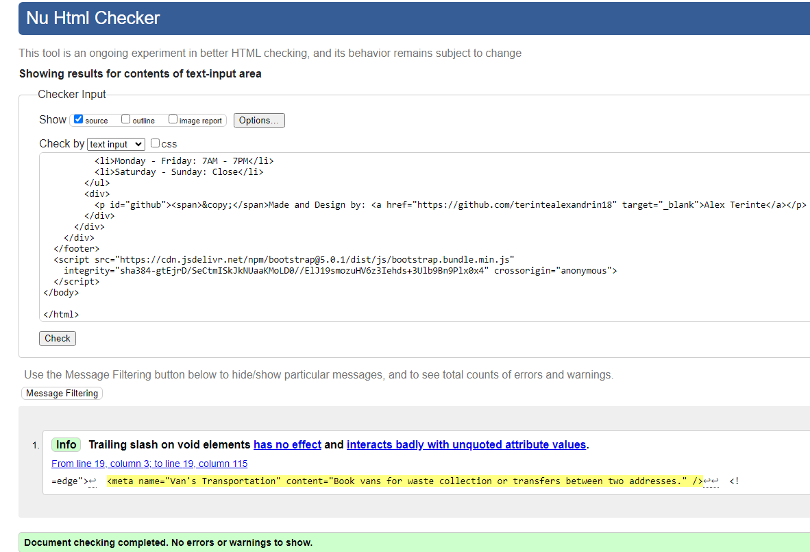
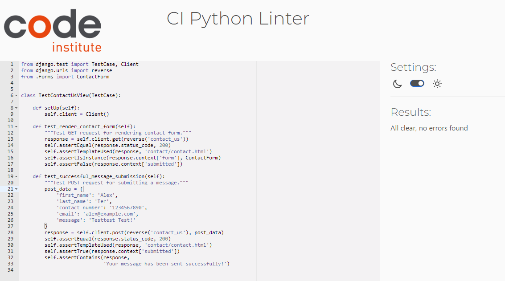

# Testing

- Testing User Stories
- HTML validation
- JavaScript validation
- Python validation
- CSS validation
- Automatic test validation
- Manual Testing 

## Testing User Stories
 1 As a Site User, I want to register a new account so that I can make online bookings.
- The users have the capability to sign up for a new account.

2 As a Site User, I want to log in to have my details automatically filled in when making a booking.
- Once signed up, users can log in to the platform.

3 As a User, I want to access comprehensive information about the services and company on the dashboard.
- On the landing page, users have access to comprehensive information about the services and the company through an introduction section.

4 As a Site User, I want to see available time slots to choose and book the desired slot.
- When making a booking, users can view available time slots and select their desired slot. If the slot is already taken, they will be notified immediately, allowing for quick adjustments.

5 As a Site User, I want to make a booking by selecting the desired service from a drop-down list to avoid manual information provision.
- The services are conveniently listed in a dropdown menu for easy selection.

6 As a Site User, I want to provide additional details about the service I need for better communication with the company.
- When making a booking, users are required to fill out the comments section, allowing them to include any necessary information.

7 As a Site User, I want to view my bookings to check their confirmation status, whether pending or confirmed.
- Users can view their bookings to check their confirmation status, whether pending, confirmed or cancelled only to logged-in users.

8 As a Site User, I want the ability to delete a booking by clicking on a button for easy management.
- Users have the ability to delete a booking by clicking on a button for easy management, accessible only to logged-in users.

9 As a Site User, I want to edit a booking by clicking the edit button to make changes without contacting support.
- Logged-in users can easily manage bookings by clicking a button to edit. If changes are made to a confirmed order, admin approval is required.

10 As a Site Admin, I want to view, approve, or delete bookings to effectively manage bookings and prevent double bookings.
- The admin can view, approve, or delete bookings from the admin panel to effectively manage bookings and prevent double bookings. (Double booking are prevented by the pythone code too).

11 As a Site User, I want easy access to the contact page to discuss additional booking details and services.
- The website provides easy access to the contact page, where users can discuss additional booking details and services. The company can be contacted via the online form, phone, email, or in person; all contact information is available on the contact page.

## HTML validation

| Page | Result | Image|
| --- | --- |--- |
|Home Page | Errors from Summernote editor| |
|Make a Booking |Pass|  |
|View my Booking |Pass|  |
|Contact Us |Pass|  |
|Sign Up |Pass|  |
|Log in |Pass|   |
|Log Out |Pass|  |

## JavaScript validation

| Page | Result | Image|
| --- | --- |--- |
|Javascript code | Pass | |

## Python validation

|Page | Result | Image|
| --- | --- |--- |
| Allbookings - Admin    | Pass    | |
| Allbookings - Form    | Pass     | |
| Allbookings - Models    | Pass     | |
| Allbookings - Test Views    |Pass     | |
| Allbookings - URLS    |Pass     | |
| Allbooking - Views    |Pass     | |
| Contact - Admin    |Pass     | |
| Contact - Forms    |Pass     | |
| Contact - Test Forms    |Pass     | |
| Contact - Test Views    |Pass     | |
| Contact - URLS   |Pass     | |
| Contact - Views    |Pass     | |
| Contact - Models    |Pass     | |
| Homepage - Admin    |Passv     | |
| Homepage - Models    |Pass     | |
| Homepage - Test Models    |Pass     | |
| Homepage - Test View    |Pass     | |
| Homepage - URLS    |Pass     | |
| Homepage - Views    |Pass     | |
| Viewthebookin - Test View  |Pass     | |
| Viewthebookin - URLS    |Pass     | |
| Viewthebookin - Views    |Pass     | |

## CSS validation

|Page | Result | Image|
| CSS sheet    | Pass     | |

## Automatic test validation
Page | Result | Image|
| Forms and View python    | pass     | |

## Manual Testing

### Home Page: