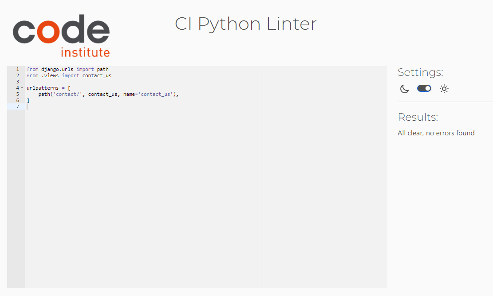
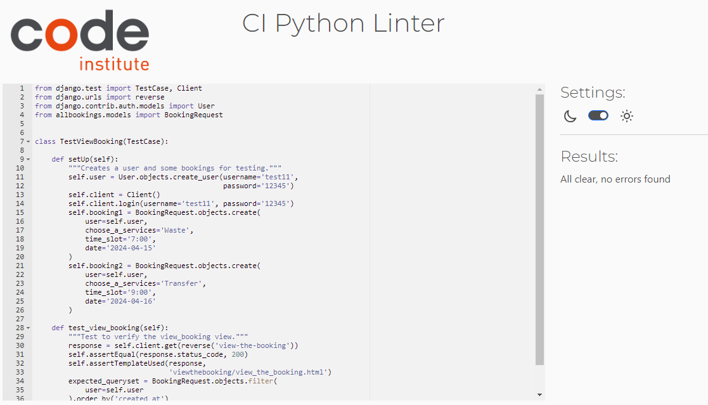

# Testing

## [Testing User Stories](#testing-user-stories)
## [HTML validation](#html-validation)
## [JavaScript validation](#javascript-validation)
## [Python validation](#python-validation)
## [CSS validation](#css-validation)
## [Automatic test validation](#automatic-test-validation)
## [Manual Testing](#manual-testing) 
## [Additional](#additional) 

## Testing User Stories
 1 As a Site User, I want to register a new account so that I can make online bookings.
- The users have the capability to sign up for a new account.

2 As a Site User, I want to log in to have my details automatically filled in when making a booking.
- Once signed up, users can log in to the platform.

3 As a User, I want to access comprehensive information about the services and company on the dashboard.
- On the landing page, users have access to comprehensive information about the services and the company through an introduction section.

4 As a Site User, I want to see available time slots to choose and book the desired slot.
- When making a booking, users can view available time slots and select their desired slot. If the slot is already taken, they will be notified immediately, allowing for quick adjustments.

5 As a Site User, I want to make a booking by selecting the desired service from a drop-down list to avoid manual information provision.
- The services are conveniently listed in a dropdown menu for easy selection.

6 As a Site User, I want to provide additional details about the service I need for better communication with the company.
- When making a booking, users are required to fill out the comments section, allowing them to include any necessary information.

7 As a Site User, I want to view my bookings to check their confirmation status, whether pending or confirmed.
- Users can view their bookings to check their confirmation status, whether pending, confirmed or cancelled only to logged-in users.

8 As a Site User, I want the ability to delete a booking by clicking on a button for easy management.
- Users have the ability to delete a booking by clicking on a button for easy management, accessible only to logged-in users.

9 As a Site User, I want to edit a booking by clicking the edit button to make changes without contacting support.
- Logged-in users can easily manage bookings by clicking a button to edit. If changes are made to a confirmed order, admin approval is required.

10 As a Site Admin, I want to view, approve, or delete bookings to effectively manage bookings and prevent double bookings.
- The admin can view, approve, or delete bookings from the admin panel to effectively manage bookings and prevent double bookings. (Double booking are prevented by the python code too).

11 As a Site User, I want easy access to the contact page to discuss additional booking details and services.
- The website provides easy access to the contact page, where users can discuss additional booking details and services. The company can be contacted via the online form, phone, email, or in person; all contact information is available on the contact page.

## HTML validation

| Page | Result | Image|
| --- | --- |--- |
|Home Page | Errors from Summernote editor| |
|Make a Booking |Pass|  |
|View my Booking |Pass|  |
|Contact Us |Pass|  |
|Sign Up |Pass|  |
|Log in |Pass|   |
|Log Out |Pass|  |

## JavaScript validation

| Page | Result | Image|
| --- | --- |--- |
|Javascript code | Pass | |

## Python validation

|Page | Result | Image|
| --- | --- |--- |
| Allbookings - Admin    | Pass    | |
| Allbookings - Form    | Pass     | |
| Allbookings - Models    | Pass     | |
| Allbookings - Test Forms    |Pass     | |
| Allbookings - Test Views    |Pass     | |
| Allbookings - URLS    |Pass     | |
| Allbooking - Views    |Pass     | |
| Contact - Admin    |Pass     | |
| Contact - Forms    |Pass     | |
| Contact - Test Forms    |Pass     | |
| Contact - Test Views    |Pass     | |
| Contact - URLS   |Pass     | |
| Contact - Views    |Pass     | |
| Contact - Models    |Pass     | |
| Homepage - Admin    |Pass     | |
| Homepage - Models    |Pass     | |
| Homepage - Test Models    |Pass     | |
| Homepage - Test View    |Pass     | |
| Homepage - URLS    |Pass     | |
| Homepage - Views    |Pass     | |
| Viewthebookin - Test View  |Pass     | |
| Viewthebookin - URLS    |Pass     | |
| Viewthebookin - Views    |Pass     | |

## CSS validation

|Page | Result | Image|
|-----|--------|------|
| CSS sheet|Pass| |

## Automatic test validation

|Page | Result | Image|
| --- | --- |--- |
| Forms and View Python|Pass| |

## Manual Testing

- The test was conducted on the following devices:
    - Iphone 15 Pro Max
    - Iphone 14 Pro Max
    - Iphone 8 Plus
    - Samsung S22 Ultra
    - Samsung Galaxy Tab A7
    - Microsoft Surface X -  was used to develop the project 

- The test was conducted on following  browsers:
    - Google Chrome
    - Safari
    - Microsoft Edge

-Testing for all pages common items:

|Item Tested  | Result | Comments |
|-------------|--------|----------|
| Nav Bar - links | Pass | Navigate to the correct page |
| Nav Bar - hoover effect  | Pass  | Available only on large screen |
| Nav Bar - username | Pass  | Logged in: username appears in nav bar.Logged out: message says "You are not logged in."   |    
| Web site logo - link| Pass  | Navigate to home page  |  
| Footer - hover effect | Pass   | Available only on the large screen on social media icon  |  
| Footer - social media icons | Pass  | All open in a new tab  |  
| Footer - GitHub|Pass  |Open the GitHub in a new tab  |  

- Testing for Home Page:

|Item Tested  | Result | Comments |
|-------------|--------|----------|
| Admin content| Pass | Visible on the page  |  
| Services title | Pass  | When click on titles will navigate to booking page  |  
| Services icons| Pass | Hover effect increasing size only for large screens  |  
|Book and Contact Us | Pass  | The links navigate to the correct page  |  
|List of vans   |Pass  | Hover effect increasing size only for large screens  |  
|Footer image| Pass  | Visible  on small and large screens  |  

- Testing for Make a Booking page

|Item Tested  | Result | Comments |
|-------------|--------|----------|
| Logged out | Pass  | User can not access the page if is not logged in  |  
|  Form| Pass  | Can not be submitted empty, all fields need to be filled up  |  
| Double booking | Pass  | Error message appear if booking a slot already taken  |  
| Confirmation booking  |Pass  |Confirmation message is displayed when making a booking and redirect to the View the Booking page. |  

- Testing for View my Booking page

|Item Tested  | Result | Comments |
|-------------|--------|----------|
| View the bookings |Pass  | User can see previous bookings |  
| Booking status | Pass  |Status of the bookings is visible; color coded  |  
| Edit booking button |Pass  | Redirect to the booking form  |  
| Booking same slot time |Pass  |Cannot book same time slot twice. Error message will appear.  |  
| Booking update | Pass | Booking is updating and receive the confirmation message  |  
| Delete booking button | Pass  | Show the booking before press again the delete button  | 
| Back button | Pass  | From delete the booking  redirect to the view the booking page  |  

- Testing for Contact Us page

|Item Tested  | Result | Comments |
|-------------|--------|----------|
|Submit form   |Pass  |The form can not be submitted empty. All fields are mandatory  |  
| Book a Service Now | Pass  |The button will redirect the booking page  | 
| Map |Pass  | Shows the location given  |  

- Testing for Sign Up page

|Item Tested  | Result | Comments |
|-------------|--------|----------|
|Submit form |Pass  | Need to fill up the mandatory fields  |  
| Confirmation message  |Pass  | Confirmation message appear when the account was created  | 

- Testing for Sign in page

|Item Tested  | Result | Comments |
|-------------|--------|----------|
|  Confirmation message  |Pass  |Confirmation message appear when logged in  |  

- Testing for Log out page

|Item Tested  | Result | Comments |
|-------------|--------|----------|
|  Confirmation message  |Pass  |Confirmation message appear when logged out  |  

- Testing for Admin Panel page

|Item Tested  | Result | Comments |
|-------------|--------|----------|
|Recive Bookings  |Pass  |   | 
|Change status  |Pass  |Booking status is changing(cancelled or confirmed)  |  
|Contact US  |Pass  |  | 
|Landing Page  | Pass  | Add content from admin panel.   |  
| Summernote editor  | Pass | Content visible on home page  | 

## Additional

- It appears that there is a vulnerability in the system. If I log in as a different user, click on "edit booking", copy the URL link, log out, and log back in as a different user, pasting the URL link will bring up the same editing page. However, if I make any changes to the booking and try to update it, it will not save and will throw an error. The system should not allow users to edit bookings without proper validation of user permissions. Therefore, need more defensive programming and validation of user permissions before allowing any modification to the booking.

  - 

- The app "BOOKINGS" been renamed to "HOMEPAGE".
- The app I named them wrong, but was to late to delete and create new one because I will lose all the migrations.